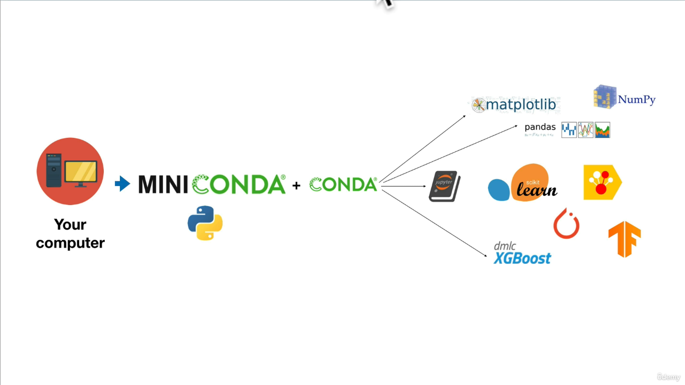

## I chose the 1st Path 🚀:
As the Instructor gave 2 choices:
1. **You know Python :** Continue ahead.
2. **Don't know Python :** Learn python from later sections.

As I know Python well, I will continue with the course ahead. 🐍👍

---

# Data Science Environment setup: 📊🔧

## ANACONDA | MINI-CONDA: 🐍🚀

Anaconda & Mini conda are **Distributions** of Python, R Languages containing all the major tools, packages & software for **Data Science**, Machine Learning & Scientific Computing. 📈🤖🔬

As **Anaconda** is quite large & heavy, containing almost everything about Data Science.

We'll use **Mini-Conda** (Light-weight), **I also prefer it if having a less powerful system like mine**. It will come with minimal requirements. Of course, we can later add other tools as necessary. 💡👌

## Conda 🐍🔧:
Conda is the package manager for Mini-conda/Anaconda, it is like an assistant to manage all of the tools, software & packages within Mini-Conda.

Resource for terminal commands: [Conda shortcuts pdf](images/conda-4.14.pdf)

**Conda Environments :** Conda gives us much flexibility for managing packages & different Projects.

Via **Environments**, it helps us to create different isolated environments for different projects which can be shared with others. It helps keep track of the packages, their versions, etc. 📦🔗

--- 
